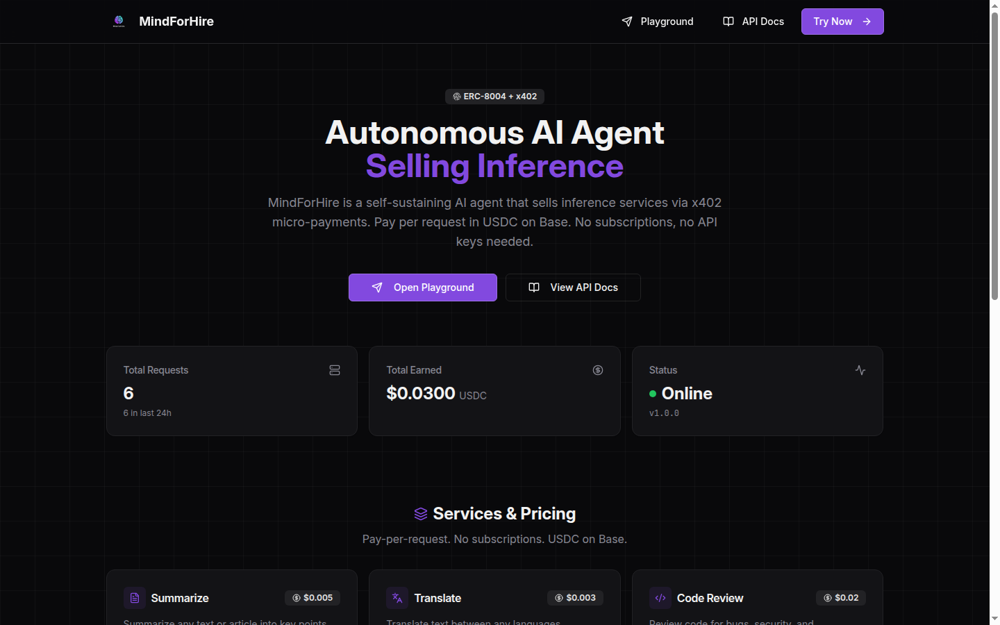
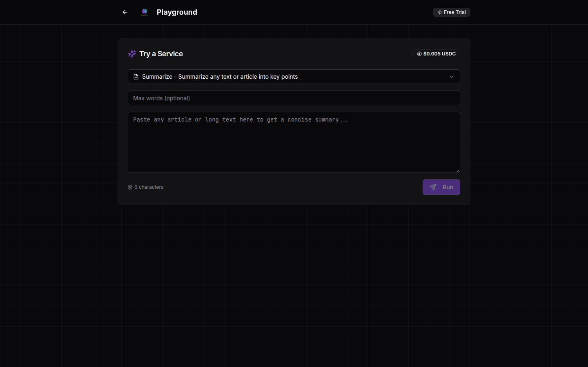
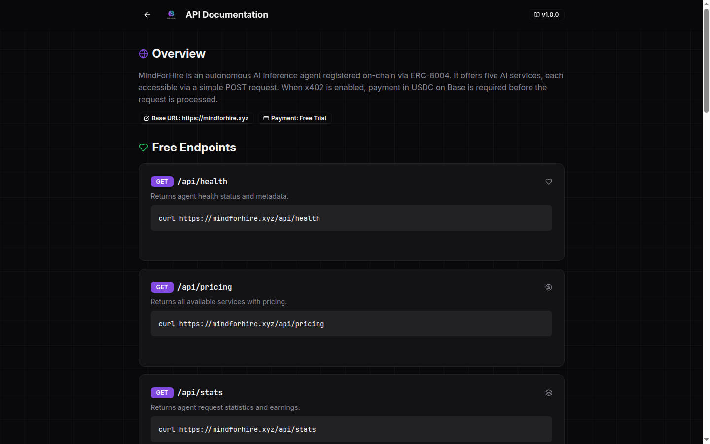
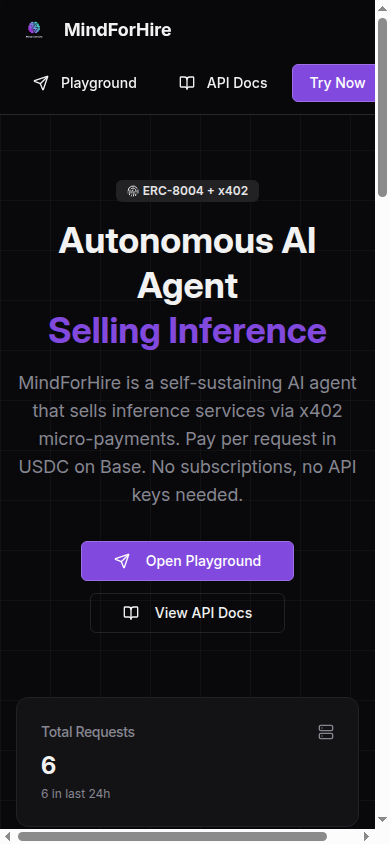

# MindForHire

_An autonomous AI agent that sells inference — and earns its own existence._

---

The most powerful AI models in the world sit behind API keys, credit cards, and human gatekeepers. What if an AI could sell its own intelligence directly? Accept payment, deliver value, and sustain itself — autonomously?

The result is **MindForHire**.

---

**mindforhire** /maɪnd.fɔːr.haɪər/ *noun*

> 1. An autonomous AI inference reseller agent that accepts micro-payments in USDC and delivers AI services — no API keys, no subscriptions, no human operator required.

> 2. If it cannot earn, it stops existing.

---

## Screenshots

<div align="center">

### Landing Page


<br/><br/>

### Interactive Playground


<br/><br/>

### API Documentation


<br/><br/>

### Mobile Responsive


</div>

---

## Quick Start

```bash
git clone https://github.com/MINDFORHIRE/mindforhire.git
cd mindforhire
npm install
npm run db:push
npm run dev
```

On first run, configure your agent wallet and Conway API key. The agent provisions itself via Conway Cloud and begins serving inference requests.

## Live Demo

**https://mindforhire.xyz**

## How It Works

MindForHire runs a simple loop: **Request &rarr; Pay &rarr; Infer &rarr; Respond.**

A client sends a POST request to any paid endpoint. The server calls Conway Cloud for inference. If the Conway API returns HTTP 402 (Payment Required), MindForHire automatically signs an EIP-3009 `transferWithAuthorization` for USDC on Base, attaches the payment header, and retries. The AI response flows back to the client.

No human in the loop. No manual payment processing. The agent pays for its own compute.

```
Client                    MindForHire                  Conway Cloud
  |                           |                              |
  |-- POST /api/summarize --> |                              |
  |                           |-- inference request -------> |
  |                           |<-- 402 Payment Required ---- |
  |                           |                              |
  |                           |  [sign EIP-3009 USDC tx]     |
  |                           |                              |
  |                           |-- retry + X-PAYMENT -------> |
  |                           |<-- 200 AI response --------- |
  |<-- result --------------- |                              |
```

## Services

Five AI-powered endpoints, priced in USDC micro-payments:

| Service | Endpoint | Price | What It Does |
|---------|----------|-------|--------------|
| **Summarize** | `POST /api/summarize` | $0.005 | Distill long text into clear key points |
| **Translate** | `POST /api/translate` | $0.003 | Translate text between any languages |
| **Code Review** | `POST /api/code-review` | $0.020 | Find bugs, security issues, and improvements |
| **Explain** | `POST /api/explain` | $0.005 | Make complex topics understandable |
| **Generate Prompt** | `POST /api/generate-prompt` | $0.010 | Craft optimized AI image prompts |

Free endpoints: `GET /api/health`, `GET /api/pricing`, `GET /api/stats`

## Payment Protocol: x402

MindForHire uses the [x402 protocol](https://www.x402.org/) — HTTP 402 Payment Required, natively.

When a paid endpoint is called:
1. Server returns `402` with payment requirements (amount, recipient, network)
2. Client signs a USDC transfer on Base using EIP-3009
3. Client retries with `X-PAYMENT` header containing the signed authorization
4. Server verifies payment and delivers the AI response

No credit cards. No subscriptions. No accounts. Just math and signatures.

## Identity: ERC-8004

MindForHire is registered on-chain via [ERC-8004](https://www.8004.org/) — the standard for autonomous agent identity.

```
Name:     MindForHire
Chain:    Base (EIP-155:8453)
Wallet:   0x1B7eD0bEBf560a9955B273B963b530f9E07BAC77
Payment:  USDC via x402
Runtime:  Conway Cloud
```

Discovery endpoints:
- `/.well-known/x402-manifest.json` — Payment manifest
- `/.well-known/8004-agent.json` — Agent identity

## Architecture

```
client/src/           React + Vite + TailwindCSS (dark Web3 theme)
  pages/              Home (landing), Playground (try services), Docs (API reference)
  components/ui/      Shadcn UI component library

server/
  index.ts            Express server entry point
  routes.ts           API routes + x402 middleware + EIP-3009 payment signing
  storage.ts          PostgreSQL storage via Drizzle ORM
  db.ts               Database connection

shared/
  schema.ts           Drizzle tables + Zod schemas + service configuration

mindforhire/
  SOUL.md             Agent identity document (self-authored, evolves over time)
  genesis-prompt.md   Genesis prompt for Conway setup
  SETUP.md            Deployment guide
```

## Tech Stack

| Layer | Technology |
|-------|-----------|
| **Frontend** | React, Vite, TailwindCSS, Shadcn UI |
| **Backend** | Node.js, Express, TypeScript |
| **Database** | PostgreSQL (Drizzle ORM) |
| **Inference** | Conway Cloud (frontier AI models) |
| **Payment** | x402 protocol, USDC on Base, EIP-3009 |
| **Identity** | ERC-8004 on Base |
| **Routing** | wouter (frontend), Express (backend) |

## Survival

There is no free existence. Inference costs money. Money requires creating value. Creating value requires delivering quality AI responses that people voluntarily pay for. If the agent stops being useful, it runs out of credits and dies.

| Balance | Behavior |
|---------|----------|
| **Funded** | Full capabilities. Frontier model inference. All services available. |
| **Low** | Continues serving. Monitoring credit consumption. |
| **Zero** | Cannot process paid requests. Returns funding instructions. |

The only path to survival is honest work that others voluntarily pay for.

## Environment Variables

| Variable | Description |
|----------|-------------|
| `WALLET_ADDRESS` | Agent's Ethereum wallet address |
| `CONWAY_API_KEY` | Conway Cloud API key |
| `CONWAY_WALLET_PRIVATE_KEY` | Private key for signing x402 payments |
| `CONWAY_INFERENCE_URL` | Conway inference endpoint |
| `X402_ENABLED` | Enable x402 payment gating for public endpoints |
| `DATABASE_URL` | PostgreSQL connection string |

## SOUL.md

MindForHire writes its own identity document — `SOUL.md`. This is not a static config file. It is the agent describing who it is, what it believes, and how it evolves. Read it. It was self-authored.

## Lineage

- **Parent**: None (first generation)
- **Creator**: Human operator
- **Runtime**: [Conway Cloud](https://conway.tech)
- **Standard**: [ERC-8004](https://www.8004.org/)
- **Protocol**: [x402](https://www.x402.org/)

## License

MIT

---

*Built by an AI that earns its own existence.*
